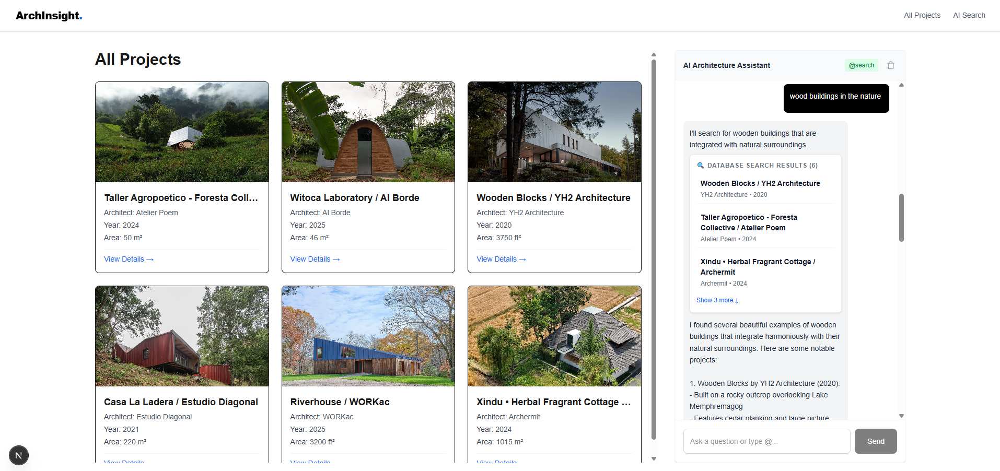

# 🏛️ ArchInsight AI

**The Intelligent Architectural Knowledge Hub** : A full-stack platform featuring automated data orchestration, vector-based semantic search, and a multi-agent AI conversational system.



---

## Overview

ArchInsight AI is more than just a gallery; it is a sophisticated knowledge engineering project. It utilizes a Python-based ETL pipeline to scrape high-fidelity data from [ArchDaily](https://www.archdaily.com), generates semantic embeddings via OpenAI, and provides a Next.js interface where users can "talk" to their architectural library using specialized AI agents.

```
archinsight_ai/
├── data-pipeline/     # Python ETL: scrape → embed → store
└── web-app/           # Next.js frontend + AI API routes
```

---

## Features

- **Semantic Project Discovery** — Powered by `pgvector` and OpenAI's `text-embedding-3-small`. Find projects by design intent (e.g., "minimalist concrete houses in sloped terrain") rather than just keywords.
- **Multi-agent AI chat** — three specialized agents switchable mid-conversation with `@` triggers:
  - `@search` — searches the vector database for relevant projects
  - `@project` — deep-dives into a specific project using RAG and live web search.
  - `@case` — PPT Automation (OpenClaw Integration): Instantly structure architectural case studies and export them as PPTX layouts via AI-driven automation. (WIP)
- **Persistent chat history** — Chat histories are isolated by `projectId` and persisted to `localStorage`, ensuring a seamless experience when switching between projects.
- **Automated data pipeline** — A Playwright-driven scraper that handles lazy-loading, dynamic DOM rendering, and automated data deduplication.
- **High-Res Image Pipeline** — Automatically extracts "large" format images, processes them via `io.BytesIO` in-memory, and persists them to Cloudflare R2 for lightning-fast globally distributed loading.

---

## Tech Stack

| Layer          | Technology                                    |
| -------------- | --------------------------------------------- |
| Frontend       | Next.js 16, React 19, Tailwind CSS 4          |
| AI / LLM       | Vercel AI SDK, OpenAI, OpenRouter             |
| Vector Search  | PostgreSQL 16 + pgvector                      |
| Data Pipeline  | Python 3, Playwright, psycopg2, Cloudflare R2 |
| Infrastructure | Docker & Docker Compose                       |

---

## Getting Started

### Prerequisites

- [Docker](https://www.docker.com/) (for the database)
- Node.js ≥ 18 (for the web app)
- Python ≥ 3.10 (for the data pipeline)
- API Keys: OpenAI, Cloudflare R2 (Access Key/Secret), and Tavily (for web search).

---

### 1. Start the database

```bash
docker-compose up -d
```

Spins up a `pgvector/pgvector:pg16` Postgres instance on port `5434`.

Copy `.env.example` to `.env`:

```env
POSTGRES_USER=your_user
POSTGRES_PASSWORD=your_password
POSTGRES_DB=archinsight
```

---

### 2. Configure Environment Variables

Data Pipeline (data-pipeline/.env):
Copy `.env.example` to `.env`:

```env
OPENAI_API_KEY=xxxxx
OPENAI_API_BASE=https://openrouter.ai/api/v1
CLOUDFLARE_ACCOUNT_ID=your_account_id
CLOUDFLARE_ACCESS_KEY=your_access_key
CLOUDFLARE_SECRET_KEY=your_secret_key
CLOUDFLARE_BUCKET_NAME=archinsight
DB_NAME= xxxxx
DB_USER= xxxxx
DB_PASSWORD= xxxxx
DB_HOST=localhost
DB_PORT=5434
```

Web App (web-app/.env.local):

```env
OPENAI_API_KEY=xxxxx
OPENAI_API_BASE=https://openrouter.ai/api/v1
TAVILY_API_KEY=xxxxx
DATABASE_URL=xxxxx
NEXT_PUBLIC_R2_DOMAIN=xxxxx
```

---

### 2. Run the data pipeline

```bash
cd data-pipeline
python -m venv venv
source venv/bin/activate        # macOS / Linux
# venv\Scripts\activate         # Windows

pip install -r requirements.txt
playwright install chromium

python main.py
```

The pipeline will: scan lists → extract full-text descriptions → upgrade image URLs to high-res → transfer to R2 → generate embeddings → store in Postgres.

---

### 3. Run the web app

```bash
cd web-app
npm install
npm run dev
```

Open [http://localhost:3000](http://localhost:3000).

---

## Project Structure

### `data-pipeline/`

| File           | Purpose                                            |
| -------------- | -------------------------------------------------- |
| `main.py`      | Orchestrates the ETL loop (scrape → embed → store) |
| `scraper.py`   | Playwright scraper for ArchDaily project pages     |
| `processor.py` | Image processing and embedding generation          |
| `db.py`        | PostgreSQL helpers: init, deduplicate, insert      |
| `config.py`    | Centralised configuration and env loading          |

### `web-app/`

| Path                | Purpose                                        |
| ------------------- | ---------------------------------------------- |
| `app/all-projects/` | Browsable project library                      |
| `app/project/[id]/` | Single-project detail + AI chat                |
| `app/api/chat/`     | Agent API routes (search, project, case-study) |
| `components/chat/`  | Chat UI, agent switcher, message renderers     |
| `app/lib/`          | DB client, RAG logic, agent definitions        |

---

## Engineering Highlights

- **Decoupled pipeline and frontend** — data ingestion (scrape → embed → store) runs as an
  independent Python pipeline; the Next.js app is purely a consumer of the database,
  with no coupling between the two layers

- **Decoupled storage** — images in R2, metadata in Postgres; keeps the database lean and
  pgvector queries fast

- **JS injection scraping** — injects JavaScript directly into the browser to extract content
  by density rather than CSS selectors, reliable on modern reactive pages

- **In-memory image transfer** — images stream from source to R2 via memory buffer,
  never touching local disk

- **Fresh-context scraping** — each project is fetched in a new Playwright browser context,
  bypassing session-based content restrictions

- **RAG-grounded agents** — project context is retrieved from pgvector at query time and
  injected into the system prompt, keeping responses factual

- **Multi-agent routing** — one `AIChat` component switches between three agents via `@`
  triggers, each with its own tools and system prompt

- **Hydration-safe persistence** — chat history loads from `localStorage` post-mount only,
  preventing SSR/CSR mismatch

- **Type-safe message rendering** — AI SDK parts typed as a discriminated union,
  exhaustive switch rendering with no `any`

---

## Roadmap

- [ ] Complete `@case` case study ppt generation agent
- [ ] Add filters to project library (year, location, architect)
- [ ] Support multiple data sources beyond ArchDaily
- [ ] User authentication and saved searches
